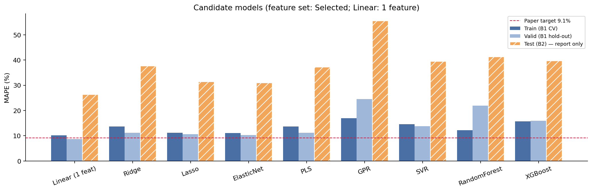
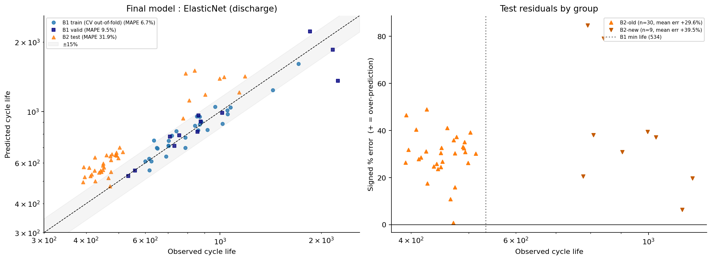

# ESS 배터리 수명 예측

ESS 셀 교체 비용은 설비 CAPEX의 30~40%를 차지한다. 이 프로젝트는 **초기 100 사이클 데이터만으로 셀의 수명(cycle life)을 예측**해, 열화가 눈에 보이기 전에 교체 시점을 계획할 수 있는지 검증한다.

## 프로젝트 개요
- 데이터셋 : MIT-Stanford Battery Dataset (Severson et al., Nature Energy 2019) — LFP/graphite 셀 A123 APR18650M1A (1.1 Ah)
- 학습 데이터 : Batch 1 (2017-05-12) · 41셀
- 평가 데이터 : Batch 2 (2018-02-20) · 39셀
- 비교 데이터 : Batch 3 (2018-04-12) · 40셀 — EDA의 배치 간 비교에만 사용 (모델 테스트에는 사용하지 않음)
- 태스크 : **Regression** — 타깃 `log10(cycle_life)`, 평가 지표 MAPE
- 원논문 목표 : MAPE 9.1%

> **데이터 주의** : 원논문의 Batch 2는 `2017-06-30` 파일이며, 이 과제의 `2018-02-20` 파일은 논문에 없는 별도 실험이다 (논문의 B1–B2 병합 쌍이 정책·용량 모두 이어지지 않음, `01_EDA` 0-2). 따라서 원논문 성능과의 차이(Gap)는 이 조건 차이를 전제로 해석한다.

## 파일 구조
~~~
├── data/
│   └── README.md                    # 데이터 출처 · 다운로드 · 생성 파일 설명
├── notebooks/
│   ├── 01_EDA.ipynb                 # 품질 진단 · 정제 근거 · Q1~Q5 (배치 비교)
│   ├── 02_feature_engineering.ipynb # 타깃 변환 · ΔQ 사이클 쌍 · 배치 안정성 · VIF · 피처 세트
│   └── 03_modeling.ipynb            # 후보 모델 비교 · 선택 · 성능 리포트 · 오류 분석
├── src/
│   ├── preprocess.py                # kagglehub 다운로드, h5py 선택 로딩, 진단, 정제
│   ├── features.py                  # ΔQ(V) · 용량 곡선 · 온도 · 저항 · 정책 피처, VIF
│   ├── train.py                     # 분할, GroupKFold 탐색, 모델 비교·선택, 평가
│   └── utils.py                     # 결과 로그 · 그림 저장
├── results/
│   ├── model_performance.csv        # 성능 리포트 (포맷)
│   ├── model_comparison.csv         # 전체 후보 모델 × 피처 세트 결과
│   └── 0X_*/                        # 노트북별 그림 · 로그 · 예측값
├── requirements.txt
└── README.md
~~~

## 환경 설정
~~~bash
git clone https://github.com/chanmi05/SKALA-DS-miniProject
cd SKALA-DS-miniProject
pip install -r requirements.txt
~~~
노트북을 `01 → 02 → 03` 순서로 실행한다. 01이 데이터(약 8GB)를 내려받아 `data/processed/dataset.pkl`로 저장하고, 02가 `features.csv`·`feature_sets.json`을, 03이 `results/`를 만든다. 학습만 다시 돌릴 때는 `python -m src.train`.
Google Colab에서는 각 노트북 첫 셀의 `WORK_DIR`을 Drive의 프로젝트 위치로 바꾸면 된다.

## EDA

데이터 정제 : 139셀 → **120셀** (B1 41 · B2 39 · B3 40). EOL 전에 측정이 끝난 셀, 고정 정책이 아닌 실험(VarCharge·SLOWCYCLE), 논문 지정 노이즈 채널을 제외했다. B1 장수명 5셀(b1c0~4)은 논문이 보고한 최종 수명을 라벨로 썼다.

- **Cycle Life 분포**
  - 로그 변환으로 왜도 1.46 → 0.27. 세 배치의 분포는 서로 다르다 (크루스칼-월리스 p = 2.5×10⁻¹¹)
  - B2는 단수명(<500) 72%, B1·B3는 0%
  - 핵심 발견 : **B2 셀의 77%가 학습 데이터(B1)의 최솟값 534보다 짧다** → 학습 범위 밖을 예측해야 하는 문제

- **열화 곡선 분석**
  - 열화 속도는 수명 후반에 14~36배 빨라진다 (20~40% 구간 대비 80~100% 구간)
  - Knee point는 배치와 무관하게 수명의 약 75~80% 지점 (knee–수명 r = 0.99)
  - 핵심 발견 : 초기 100 사이클은 knee보다 훨씬 앞이라 **용량이 거의 줄지 않는다**(80% 셀은 오히려 증가) → 용량 값만으로는 예측 불가

- **ΔQ(V) 곡선 분석**
  - ΔQ₁₀₀₋₁₀(V) = 사이클 100과 10의 방전 전압 곡선 차이. 단수명 셀일수록 3.0~3.2 V 부근의 골이 깊다
  - log Var(ΔQ)와 log 수명 : r = −0.945 (B1) · −0.918 (B2) · −0.805 (B3), 논문 −0.93 재현
  - 핵심 발견 : **세 배치에서 모두 강하고 방향이 같은 유일한 신호**. 단, 같은 ΔQ에서 B2 수명이 약 20% 짧은 평행 이동이 있다

- **충전 속도(C-rate)와 수명의 관계**
  - B1에서는 평균 C-rate가 높을수록 수명이 짧다 (Spearman ρ = −0.62)
  - B2·B3는 모든 셀이 약 10분 충전으로 설계되어 평균 C-rate가 사실상 상수 (표준편차 0.004~0.005)
  - 핵심 발견 : 같은 정책이라도 배치·`newstructure` 표기에 따라 수명이 최대 3배 다르다. B2 안에서 old 451 vs new 904 (맨-휘트니 p = 7×10⁻⁶), B1에는 new 셀이 없다

- **상관관계 · 다중공선성**
  - 후보 피처 24개 중 14개는 배치 간 상관 부호가 바뀐다 (충전 시간, 평균 C-rate, 초기 용량, IR 등)
  - B1 기준 24개 중 23개가 VIF ≥ 10

## Modeling

### 피처 엔지니어링 전략
원본 신호를 수명과의 관계가 드러나는 **파생변수**로 바꿨다 : 타깃·ΔQ 분산의 로그 변환, ΔQ 곡선 통계량(분산·왜도·첨도 등), 정책 문자열의 수치 분해(C1·Q1·C2·평균 C-rate), 사이클 구간별 용량 기울기·온도·저항 요약값.

선택은 "B1에서 강한가"가 아니라 **"세 배치에서 같은 방향인가"**를 기준으로 했다.

후보 24개 → ① 중복 제거(VIF < 10) 13개 → ② 세 배치 상관 부호 일치 **7개 (Selected)**

| 세트 | 구성 | 용도 |
|---|---|---|
| Selected (7) | dq_log_var, dq_skew, dq_kurt, qd_slope_91_100, tmax_2_100, Q1, C2 | 주 피처 |
| Variance (1) | dq_log_var | 기준선 (논문 Variance model) |
| Discharge (13) | ΔQ 통계 6 + 용량 곡선 7 | 논문 Discharge model 구성 |
| Full (20) | Discharge + 충전 시간 · 온도 · 저항 | 논문 Full model 구성 |

### 모델 선택 및 근거
- 선정 기준 (EDA 근거) : A. 학습 범위 밖 예측 (Q1) · B. 공선성에 강함 (Q5) · C. 41셀 소표본 과적합 억제 · D. 로그-로그 선형 구조 (Q3) · E. 해석 가능성
- 후보 모델 : Linear(1 피처), Ridge, Lasso, **Elastic Net**, PLS, SVR, GPR, Random Forest, XGBoost
  - 트리 모델은 예측값이 학습 수명 범위(534~2237)를 벗어나지 못해 기준 A를 충족하지 못한다 → 비교군
- 검증 : B1을 정책 그룹 단위로 Train / Valid(≈25%) 분할, Train 안에서 정책 단위 5-fold GroupKFold로 하이퍼파라미터 탐색
- 선택 규칙 : ① CV MAPE 최소 ② Valid − CV > 5%p면 과적합으로 제외 ③ 1%p 이내면 단순한 모델 ④ **B2 성능은 선택에 사용하지 않음**
- 최종 모델 : **Elastic Net + Discharge 피처 세트(13개)** — α = 0.0053, L1 비율 = 0.5
- 선택 이유
  - 규칙 ② : GPR(Valid − CV = +7.5%p)과 Random Forest(+9.7%p)는 과적합으로 제외
  - 규칙 ① : 남은 후보 중 CV MAPE 최소 6.69% (2위 Elastic Net Full 9.57%와 2.9%p 차이 → 규칙 ③ 해당 없음)
  - Elastic Net이 13개 중 6개만 남겼고, 그중 **log Var(ΔQ) 계수(−0.144)가 나머지(0.003~0.018)보다 8배 이상 크다** → 모델이 EDA에서 찾은 핵심 신호를 그대로 쓰고 있다
  - EDA 기준으로 고른 Selected(7개)는 CV 11.07%로 Discharge보다 낮았다. 사람이 미리 고르는 것보다 L1이 방전 피처 안에서 고르는 편이 B1에서는 더 나았다

## 성능 결과

| 구분 | MAPE (%) | 비고 |
|---|---|---|
| Train (Batch 1 CV) | 6.69 | Train 29셀, 정책 단위 5-fold |
| Valid (Batch 1 Hold-out) | 9.53 | 12셀 (6개 정책) |
| Test (Batch 2) | **31.86** | Batch 1 전체(41셀)로 재학습 · RMSE 229 cycles |
| Gap (Train-Valid) | +2.84 | (+) : 과적합 의심 — 규칙 기준(5%p) 이내 |
| Gap (Valid-Test) | **+22.33** | (+) : 배치간 일반화 저하 의심 |
| Gap (Target-Test) | +22.76 | Target : 원논문 9.1% |

**Gap 해석**
- **Train–Valid (+2.8%p)** : 과적합은 작다. Valid 오차의 대부분은 논문 라벨을 쓴 장수명 셀 b1c2(실제 2237, 예측 1360, −39%) 한 셀에서 나왔고, 나머지 11셀은 −14% ~ +20%다.
- **Valid–Test (+22.3%p)** : **B2 39셀 전부를 과대예측했다** (평균 +31.9%). 오차가 무작위가 아니라 한 방향으로 쏠린 **체계적 편향(bias)**이다. 예측값과 실제값의 로그 상관은 0.95, 순위 상관(Spearman)은 0.85로 높아서, 모델은 B2 안에서 "어느 셀이 더 오래 가는지"는 맞히지만 수명의 절대 수준을 일정 비율로 높게 잡는다.
- **Target–Test (+22.8%p)** : 원논문의 9.1%는 2017-05-12·2017-06-30 배치를 섞어 학습/테스트한 결과다. 이 과제는 논문에 없는 실험(2018-02-20)을 배치 단위로 테스트하므로 같은 조건의 비교가 아니다. 참고로 B1 안의 성능(CV 6.7%, Valid 9.5%)은 논문 수준이다.

## 오류 분석

**모델이 가장 크게 틀린 셀의 공통점**

| 그룹 | 셀 수 | MAPE | 평균 부호 오차 | 과대예측 비율 |
|---|---|---|---|---|
| B2-old | 30 | 29.6% | +29.6% | 100% |
| B2-new (`newstructure`) | 9 | 39.5% | +39.5% | 100% |

- 오차 상위 1·2위(b2c9 +85%, b2c44 +79%)가 모두 **new 셀**이고, 상위 8셀 중 3셀이 new다. new는 B2 39셀 중 9셀(23%)뿐인데 상위권에 몰려 있다. new 셀은 B1에 한 번도 없던 조건이다.
- 오차는 학습 범위 밖 셀(B2-old, 수명 < 534)보다 **학습 범위 안 셀(B2-new)에서 더 크다**. → "학습 범위 밖이라서" 틀린 것이 아니라 **배치·조건 자체가 다르기 때문**이다.

**원인 가설**
- EDA Q3에서 B2의 log Var(ΔQ)–log 수명 회귀선이 B1보다 약 0.1(log) 아래에 평행하게 있었다. 같은 ΔQ 값에서 B2 수명이 약 26%(100.1) 짧다는 뜻인데, 실제 테스트의 평균 로그 오차는 +0.117(약 +31%)로 **EDA에서 예상한 편향과 거의 같은 크기**다.
- 이 편향은 Batch 2가 다른 실험 조건(휴지 시간, 시험 구성 등)에서 측정되었기 때문으로 보인다. B1만으로 학습하는 한 이 차이를 모델이 배울 방법이 없다.

**보고용 관찰 (모델 선택에는 사용하지 않음)**
- 피처가 많을수록 B2 오차가 커졌다 : Variance(1개) 27.6% → Discharge(13) 29.4% → Full(20) 41.2%. Day 1에서 "배치마다 상관 방향이 바뀌는 피처"로 분류한 충전 시간·온도·저항이 들어간 Full이 가장 나빴다.
- 트리 모델은 B2 예측 최솟값이 528~628로 실제 최솟값 392까지 내려가지 못했다 (B2 단수명 셀 MAPE : RF 44% · XGBoost 37% · Elastic Net(Selected) 34%).

**개선 방향**
- **배치 보정 (calibration)** : 새 배치에서 일부 셀의 실제 수명이 확보되면, 예측에 일정 비율을 곱하는 보정 한 단계만으로 편향을 크게 줄일 수 있다 (순위 상관 0.85가 유지되므로).
- **학습 데이터 다양화** : 시험 조건·셀 구성(old/new)이 다른 배치를 학습에 포함해, 배치 차이를 모델이 볼 수 있게 한다.
- **배치에 덜 민감한 피처** : 셀 자신의 초기 사이클 대비 상대 변화량(예 : ΔQ를 초기 용량으로 정규화)처럼 실험 조건의 절대 수준에 영향을 덜 받는 피처를 시도한다.

## ESS 도메인 해석

**활용**
- **셀 선별·등급 분류** : 같은 조건의 셀들 사이에서 예측 순위가 실제 순위와 잘 맞으므로(Spearman 0.85), 100 사이클 시점에 단수명 셀을 골라내 팩 구성에서 제외하거나 등급을 나누는 데 쓸 수 있다.
- **교체 계획 (예지 보전)** : 학습과 같은 조건의 셀에서는 오차 7~10% 수준이라, 용량이 눈에 띄게 줄기 훨씬 전(수명의 5~20% 시점)에 교체 시점을 미리 잡을 수 있다.

**한계와 실 배포에 필요한 것**
- 조건이 달라지면 절대 수명을 30% 가까이 과대예측한다. ESS에서 수명을 과대예측하면 교체가 늦어져 **예기치 못한 용량 부족·설비 중단**으로 이어지므로, 그대로 쓰면 위험한 방향의 오차다.
- 배포 전에 현장 조건(충전 프로파일, 온도, 셀 로트)에서 소수 셀로 **보정 데이터를 확보**하고, 예측에 안전 여유(예 : 보수적 하한)를 두어야 한다.
- 실험실 셀(30°C 챔버, 단일 셀 시험)과 달리 실제 ESS는 온도·SOC 운용 범위가 다양하고 팩 단위로 운용된다. 셀 단위 모델을 팩·랙 단위로 확장하는 검증이 추가로 필요하다.

## 참고문헌
- Severson et al. (2019). Data-driven prediction of battery cycle life before capacity degradation. *Nature Energy*, 4, 383–391.
- 원논문 공개 코드 : https://github.com/rdbraatz/data-driven-prediction-of-battery-cycle-life-before-capacity-degradation

## 팀 구성
- 박찬미 (울산 3반) : EDA, 피처 엔지니어링, 모델 개발, 성능 평가 (Batch 2)
